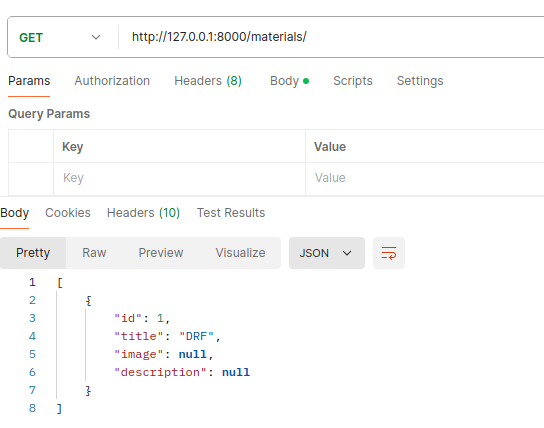
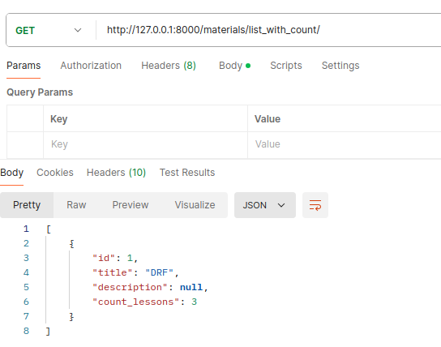
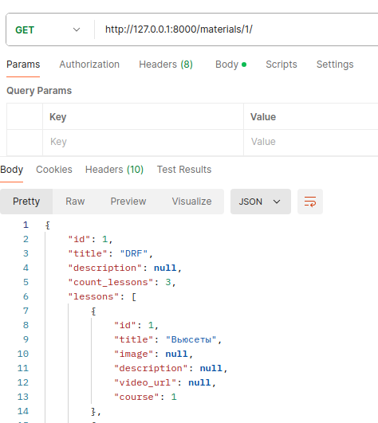
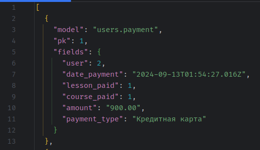

## Вьюсеты и дженерики

### Вывод курсов базовый

### Вывод курсов с кол-вом уроков

### Вывод курсов с кол-вом уроков и информацией об уроках

### Создана модель Payment(платежи) и фикстура на её основе

### Список платежей с сортировкой
##### по дате: /users/payment/?ordering=-date_payment
##### по курсу: /users/payment/?course_paid=1
##### по типу платежа /users/payment/?payment_type=Кредитная карта
